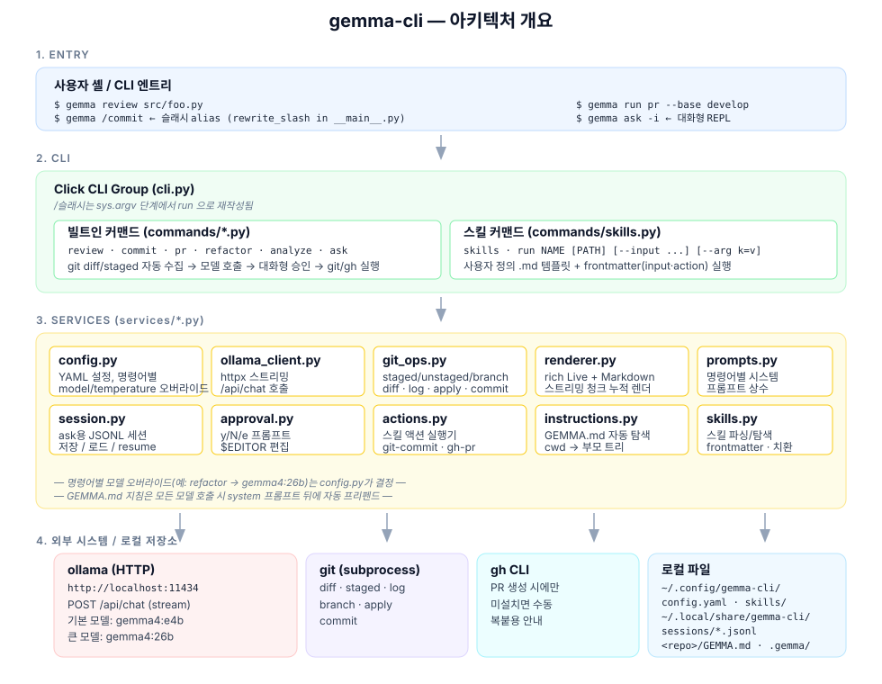
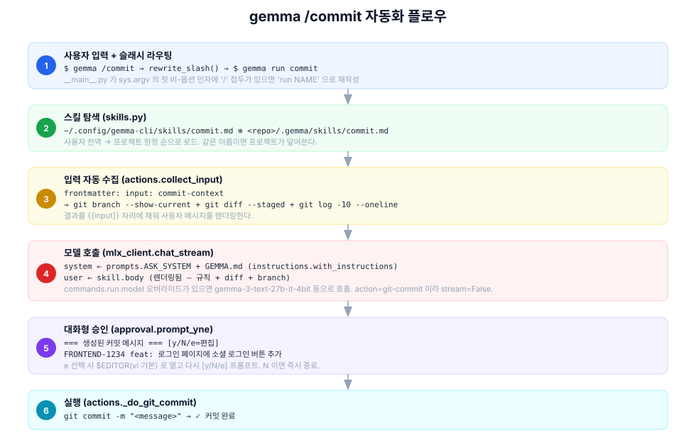
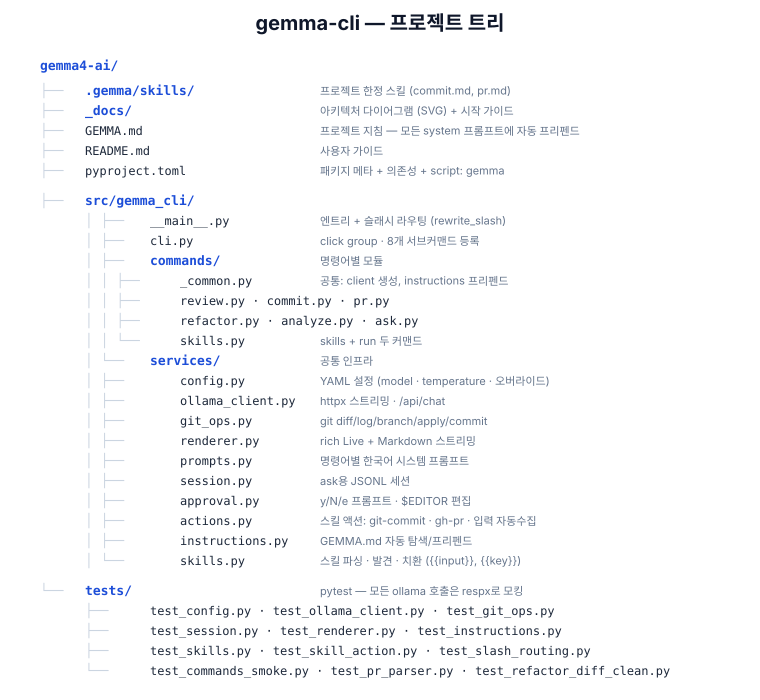

# gemma-cli

`gemma4` (MLX) 기반 로컬 개발 보조 CLI. **코드 리뷰**, **커밋/PR 메시지 생성**, **리팩토링**, **코드 분석**, **자유 질의**를 단일 명령어 `gemma`에서 한국어로 제공한다. 모델 추론은 Apple Silicon에서 [`mlx-lm`](https://github.com/ml-explore/mlx-lm)으로 인프로세스 실행 — 별도 서버가 필요 없다. 사용자 정의 **프로젝트 지침(`GEMMA.md`)** 과 **스킬(`*.md`)** 도 지원.

> 🚀 **처음 설치하시는 분은 [`_docs/GETTING_STARTED.md`](_docs/GETTING_STARTED.md) 부터 보세요.**
> Python·uv·MLX·gemma4·gemma-cli 설치와 첫 명령 성공까지 단계별 검증 포함.

```text
gemma ────┬── review     코드 리뷰
          ├── commit     커밋 메시지 생성 + 대화형 승인
          ├── pr         PR 제목/본문 생성 + 대화형 승인
          ├── refactor   unified diff 제안 + 미리보기 + 적용
          ├── analyze    구조/의존성/잠재 이슈 분석
          ├── ask        자유 질의 (단발 / REPL / 세션 재개)
          ├── skills     등록된 사용자 정의 스킬 목록
          ├── run NAME   스킬 실행
          ├── NAME       스킬 실행 (1급 커맨드 — `.gemma/skills/NAME.md`를 두면 자동 노출)
          └── /NAME      스킬 실행 (슬래시 alias, 예: gemma /commit)
```

> `.gemma/skills/<이름>.md`(또는 전역 스킬)를 추가하기만 하면 **코드 수정 없이** `gemma <이름>`로 호출되고 `gemma --help` 목록에도 나타난다. 빌트인과 이름이 겹치면(`commit`/`pr`) 빌트인이 우선이며, 스킬 쪽은 `/commit`처럼 슬래시로 부른다.

## 아키텍처

전체 구조와 데이터 흐름은 아래 다이어그램으로 정리되어 있다. 원본은 [`_docs/`](_docs/) 디렉터리에 SVG로 보관 — 텍스트 기반이라 git diff/PR 리뷰가 가능하다.



스킬 자동화(`gemma /commit`) 한 사이클의 단계별 흐름:



프로젝트 트리(상세 책임 포함):



---

## 목차
0. [아키텍처](#아키텍처)
1. [전제 조건](#1-전제-조건)
2. [설치](#2-설치)
3. [빠른 시작](#3-빠른-시작)
4. [명령어 레퍼런스](#4-명령어-레퍼런스)
   - [review](#review--코드-리뷰)
   - [commit](#commit--커밋-메시지-생성)
   - [pr](#pr--pr-제목본문-생성)
   - [refactor](#refactor--파일-리팩토링)
   - [analyze](#analyze--구조의존성-분석)
   - [ask](#ask--자유-질의)
   - [skills / run](#skills--run--사용자-정의-스킬)
5. [프로젝트 지침 `GEMMA.md`](#5-프로젝트-지침-gemmamd)
6. [사용자 정의 스킬](#6-사용자-정의-스킬)
7. [설정 파일](#7-설정-파일)
8. [개발 / 테스트](#8-개발--테스트)
9. [문제 해결](#9-문제-해결)

---

## 1. 전제 조건

- macOS (Apple Silicon) — `mlx-lm`이 Apple Silicon 전용이다.
- Python ≥ 3.11
- 별도 서버나 데몬 불필요. 모델 추론은 `mlx-lm`으로 **인프로세스(in-process)** 실행되며, 모델은 처음 사용할 때 HuggingFace에서 자동 다운로드된다.

> 모델을 미리 받아두려면(선택): `huggingface-cli download mlx-community/gemma-3n-E4B-it-lm-4bit`
> 처음 명령 실행 시 자동으로도 받아진다.

> ⚠️ **반드시 텍스트 전용 모델을 쓰세요.** 이 CLI는 텍스트 전용 `mlx-lm`을 사용합니다. `gemma-4`/`gemma-3n`의 e4b·26b, `gemma-3`의 4b/12b/27b는 모두 멀티모달(VLM)이라 로드하면 `Received N parameters not in model: language_model...` 오류로 실패합니다. 텍스트 전용 변형(`-lm` 또는 `-text-`)을 쓰세요 — 예: `mlx-community/gemma-3n-E4B-it-lm-4bit`, `mlx-community/gemma-3-text-27b-it-4bit`, `mlx-community/gemma-3-1b-it-4bit`.

`git`은 `review`/`commit`/`pr`/`refactor` 사용 시 필수. `gh` CLI는 `pr` 명령어로 실제 PR을 생성할 때만 필요.

## 2. 설치

[`uv`](https://docs.astral.sh/uv/)를 권장.

```bash
# uv 미설치 시
curl -LsSf https://astral.sh/uv/install.sh | sh

# 전역 도구로 설치 (어디서나 `gemma` 명령 사용)
uv tool install .

# 또는 개발 모드 (현재 디렉터리에서만 사용)
uv sync --extra dev
uv run gemma --help
```

## 3. 빠른 시작

```bash
# 1) 기본 설정 파일 생성 (선택)
mkdir -p ~/.config/gemma-cli
cat > ~/.config/gemma-cli/config.yaml <<'YAML'
model: mlx-community/gemma-3-text-27b-it-4bit   # 기본값 — ask 를 제외한 모든 명령이 사용
temperature: 0.2
max_tokens: 2048
commands:
  ask:
    model: mlx-community/gemma-3n-E4B-it-lm-4bit   # 자유 질의는 가벼운 e4b 로 빠르게
YAML

# 2) 사용해보기 (첫 실행 시 모델 자동 다운로드)
gemma ask "Python에서 list와 tuple 차이를 한 줄로 설명해줘."
```

---

## 4. 명령어 레퍼런스

모든 명령어는 한국어로 응답하며 결과는 `rich`로 스트리밍 렌더링됨.

### `review` — 코드 리뷰

```bash
gemma review                  # 스테이징된 변경(없으면 언스테이징) 리뷰
gemma review src/foo.py       # 특정 파일 리뷰
gemma review src/             # 디렉터리 단위 리뷰 (50KB 미만 파일 묶어 전달)
```

출력 형식 (모델 시스템 프롬프트로 강제):
- `## 요약`
- `## 우선순위별 이슈` — 🔴 Critical / 🟡 Major / 🟢 Minor
- `## 개선 제안` — 코드 스니펫 포함

### `commit` — 커밋 메시지 생성

스테이징된 변경에 대해 Conventional Commits 한국어 메시지를 생성한다.

```bash
git add <변경된 파일들>
gemma commit
# → 생성된 메시지 표시
# → [y/N/e=편집] 프롬프트
#    y: 그대로 커밋
#    N: 취소
#    e: $EDITOR(vi 기본)로 편집 후 다시 [y/N/e]
```

생성되는 메시지 예:
```
feat: 곱셈 함수 추가

multiply 함수와 실행 예제를 추가합니다.
```

### `pr` — PR 제목/본문 생성

base 브랜치 대비 현재 브랜치의 모든 변경을 분석해 제목·본문을 만든다.

```bash
gemma pr                  # 기본 base: main
gemma pr --base develop
```

승인 후 `gh` CLI가 설치되어 있으면 실제로 `gh pr create`를 호출. 없으면 제목/본문만 출력해 수동 복붙용으로 안내.

본문은 다음 골격을 따른다:
```markdown
## 요약
- 핵심 변경 3-5개 불릿

## 테스트 계획
- [ ] 항목 1
- [ ] 항목 2
```

### `refactor` — 파일 리팩토링

지정된 파일을 unified diff 형식으로 리팩토링 제안 → 컬러 미리보기 → 승인 시 `git apply`.

```bash
gemma refactor src/foo.py
gemma refactor src/foo.py -i "함수 분리하고 타입 힌트 추가"
```

- `-i / --instruction` — 리팩토링 지시. 생략 시 기본값 `"가독성과 유지보수성을 개선해줘."`
- diff 정확도를 위해 `refactor`는 기본 모델(권장 구성: `mlx-community/gemma-3-text-27b-it-4bit`)을 사용한다. 더 작은 모델은 diff 형식이 가끔 깨질 수 있다.
- patch 적용 실패 시 원본 파일은 변경되지 않고 사유가 표시됨

### `analyze` — 구조/의존성 분석

```bash
gemma analyze              # 현재 디렉터리
gemma analyze src/gemma_cli/services
```

출력:
- `## 구조` — 모듈별 책임 표
- `## 의존성` — 외부 패키지 + 내부 결합
- `## 잠재 이슈` — 보안/성능/유지보수 관점의 우려

큰 디렉터리는 50KB 미만 파일까지만 샘플링 후 전송(전체 80KB까지).

### `ask` — 자유 질의

```bash
gemma ask "이 코드 왜 느려?"            # 단발 질의 (세션 자동 생성)
gemma ask -i                             # 대화형 REPL 진입
gemma ask --resume LAST                  # 직전 세션 이어가기
gemma ask --resume 20260518T112009-dd3   # 특정 세션 ID로 재개
gemma ask --new "처음부터 다시"          # --resume 무시하고 새 세션
```

REPL 모드 안에서:
- `:exit` / `:quit` / `:q` — 종료
- `:clear` — 히스토리 초기화 (파일 세션은 유지)

세션은 `~/.local/share/gemma-cli/sessions/<id>.jsonl`에 한 줄 = 한 메시지 형태로 저장. 종료 시 마지막에 `(세션 ID: ...)` 가 표시된다.

### `skills` / `run` — 사용자 정의 스킬

```bash
gemma skills                                   # 등록된 스킬 표 출력 (이름/설명/input/action/출처)
gemma run <이름>                                # input 없이 실행
gemma run <이름> path/to/file.ts                # 파일 내용을 {{input}}으로
gemma run <이름> path/to/dir/                   # 디렉터리 묶음을 {{input}}으로
gemma run <이름> --input "인라인 텍스트"        # 인라인 텍스트
gemma run <이름> --input "..." --arg lang=en   # 추가 변수 치환

# 1급 커맨드 — 발견된 스킬은 빌트인처럼 직접 호출된다(빌트인과 겹치지 않는 이름).
gemma <이름>                                     # == gemma run <이름>
gemma <이름> --base develop                      # run 과 동일 옵션 (INPUT_PATH/--arg/--input/--base)

# 슬래시 alias — 첫 인자가 '/'로 시작하면 자동으로 `run`으로 라우팅된다.
gemma /commit                                   # == gemma run commit  (동명 빌트인이 있어도 스킬 실행)
gemma /pr --base develop                        # == gemma run pr --base develop
```

자세한 형식은 [§6 사용자 정의 스킬](#6-사용자-정의-스킬) 참고.

### 빌트인과 스킬의 관계

`commit`/`pr`은 빌트인 커맨드(`gemma commit`, `gemma pr`)로도, 동명의 스킬(`gemma /commit`, `gemma /pr`)로도 호출 가능하다.

| | 빌트인 | 스킬 |
|---|--------|------|
| 호출 | `gemma commit` | `gemma /commit` (또는 `gemma run commit`) |
| 프롬프트 변경 | 코드 수정 필요 | `~/.config/gemma-cli/skills/commit.md` 편집 |
| 입력/액션 변경 | 불가 | frontmatter `input:` / `action:` |
| 추천 용도 | 그대로 잘 동작할 때 | 우리 팀 컨벤션·이슈 링크·이모지 등 커스터마이즈 |

---

## 5. 프로젝트 지침 `GEMMA.md`

`GEMMA.md`(또는 `gemma.md`)를 현재 디렉터리 또는 상위 디렉터리에 두면, **모든 명령 실행 시 시스템 프롬프트 뒤에 자동으로 덧붙여진다.** Claude Code의 `CLAUDE.md`와 같은 역할.

예 — `프로젝트루트/GEMMA.md`:

```markdown
# 우리 팀 코드 리뷰 가이드

- 답변은 항상 한국어로 한다.
- 모든 코드 예시에는 한국어 주석을 단다.
- 외부 라이브러리를 제안할 때는 라이선스를 함께 명시한다.
- 보안 이슈를 발견하면 OWASP 카테고리도 함께 표기한다.
```

발견 우선순위: cwd → cwd의 부모 → 그 부모 → 홈까지. 가장 먼저 발견된 한 파일이 적용된다.

---

## 6. 사용자 정의 스킬

자주 쓰는 프롬프트 템플릿을 마크다운 파일로 저장해 `gemma run <이름>`으로 호출.

### 저장 위치 (뒤가 앞을 덮어씀)

1. `~/.config/gemma-cli/skills/<이름>.md` — **사용자 전역**
2. `./.gemma/skills/<이름>.md` — **프로젝트 한정** (cwd → 부모 트리 탐색)

### 형식

YAML frontmatter + 본문 (마크다운 자유):

```markdown
---
name: explain
description: 코드/텍스트를 초급 개발자에게 친절히 설명
input: manual         # 선택. manual(기본) / staged-diff / branch-diff
action: print         # 선택. print(기본) / git-commit / gh-pr
base: main            # action: gh-pr 또는 input: branch-diff 일 때 사용
---

다음을 초급 개발자 수준으로, 비유를 곁들여 단계별로 설명해주세요.

---

{{input}}
```

### `input` (입력 자동 수집)

| 값 | 동작 |
|----|------|
| `manual` (기본) | `--input` / 위치 인자 / 빈 문자열 |
| `staged-diff` | `git diff --staged` 결과를 `{{input}}`에 자동 채움 (스테이지 비어 있으면 에러) |
| `branch-diff` | `git diff <base>...HEAD` + 커밋 로그를 자동 채움 (`base:` 또는 `--base`로 지정) |
| `commit-context` | 스테이지된 변경이 있으면 그것을, 없으면 언스테이지 변경을 + 현재 브랜치명 + 최근 커밋 10개를 자동 채움 |
| `branch-or-files` | git 저장소면 `branch-diff`처럼 동작. 아니면 현재 디렉터리의 파일 목록 + 50KB 미만 파일 내용(총 80KB 한도)을 채움. 비-git 환경에서도 안전하게 동작 |

### `action` (모델 응답 후 실행)

| 값 | 동작 |
|----|------|
| `print` (기본) | 응답을 그대로 터미널에 스트리밍 |
| `git-commit` | 응답을 커밋 메시지로 보고 y/N/e 프롬프트 후 `git commit` |
| `gh-pr` | 응답을 `TITLE: ...\n---\n본문` 형식으로 파싱, y/N/e 후 `gh pr create` |

### 치환 변수

| 변수 | 어디서 채워지나 |
|------|-----------------|
| `{{input}}` | `input:` 설정 또는 `--input` / 위치 인자 |
| `` | `--arg <key>=<value>`로 전달한 임의 키 (여러 번 가능) |

### 예시 스킬

`~/.config/gemma-cli/skills/naming.md`:
```markdown
---
name: naming
description: 변수/함수 이름 후보 3개 제안
---

다음 코드를 보고 더 나은 변수·함수 이름 후보 3개를 제안하세요.
각 후보는 `- name` 형식으로 한 줄씩, 마지막에 한 줄 추천 이유.

{{input}}
```

`./.gemma/skills/release-note.md` (프로젝트 한정):
```markdown
---
name: release-note
description: 변경 로그에서 사용자 친화 릴리스 노트 작성
---

언어: {{lang}}
다음 변경 로그를 사용자 친화적인 릴리스 노트로 변환하세요.
스타일은 우리 팀 규칙({{lang}})을 따릅니다.

---

{{input}}
```

```bash
gemma run release-note CHANGELOG.md --arg lang=ko
```

### 기본 제공 프로젝트 스킬: `jira`

`./.gemma/skills/jira.md` — 입력 모드 `branch-or-files`를 사용해 **지라 일감 설명 본문**을 생성한다.

- **git 저장소인 경우**: 현재 브랜치(`<base>...HEAD`) 기준 커밋 로그 + 통합 diff를 자동 수집.
- **git 저장소가 아닌 경우**: git 명령을 호출하지 않고, 현재 디렉터리의 파일 목록 + 파일 내용(50KB 미만, 총 80KB 한도)을 수집.

출력은 다음 섹션을 따른다:

`## 개요 → ## 배경 → ## 설계 → ## 변경 내용 → ## 기술 스펙 → ## 영향 범위 → ## 테스트 → ## 참고`

브랜치명에서 `[A-Z]{2,}-\d+` 이슈 키가 감지되면 개요 맨 앞에 `[KEY]`로 자동 표기. 사용 예:

```bash
# git 저장소에서: 커밋된 변경을 정리
git add -A && git commit -m "..."
gemma /jira                          # base=main
gemma /jira --base develop

# git 저장소가 아닌 곳에서: 현재 디렉터리 파일 기반
cd ~/scratch/some-prototype
gemma /jira                          # git 호출 없이 파일 트리/내용으로 정리

# 출력만 클립보드로 복사 (macOS)
gemma /jira | pbcopy
```

> git 저장소에서는 **커밋된 변경만 분석**한다. 작업 중인 파일을 포함하려면 먼저 커밋하거나 임시 커밋(`git commit -m "wip"` → 나중에 `git reset --soft HEAD~1`)을 만든 뒤 실행.

### 다른 프로젝트에서도 같은 스킬 쓰기 (전역 등록)

스킬은 두 위치 중 한 곳에 두면 된다:

| 위치 | 범위 | 추천 시점 |
|------|------|-----------|
| `./.gemma/skills/jira.md` | 이 저장소에서만 | 팀과 함께 커밋해 공유할 때 |
| `~/.config/gemma-cli/skills/jira.md` | 사용자 전역(모든 프로젝트) | 개인 도구로 어디서나 쓰고 싶을 때 |

전역으로 옮기는 방법은 둘 중 하나:

```bash
# 방법 A: 복사 (스킬 본문이 향후 갈라져도 무방할 때)
mkdir -p ~/.config/gemma-cli/skills
cp ./.gemma/skills/jira.md ~/.config/gemma-cli/skills/jira.md

# 방법 B: 심볼릭 링크 (이 저장소의 스킬을 그대로 공유 — 한 곳만 수정)
mkdir -p ~/.config/gemma-cli/skills
ln -sf "$PWD/.gemma/skills/jira.md" ~/.config/gemma-cli/skills/jira.md
```

이후 임의의 git 저장소에서 다음과 같이 동작한다:

```bash
cd ~/work/another-project
gemma /jira              # 현재 디렉터리의 브랜치 기준으로 동일하게 동작
gemma /jira --base develop
```

`branch-diff`는 항상 **현재 작업 디렉터리의 git 저장소**를 기준으로 동작하므로, 다른 프로젝트에서도 그 프로젝트의 브랜치 변경이 그대로 입력된다.

### 기본 제공 프로젝트 스킬: `qa`

`./.gemma/skills/qa.md` — jira와 같은 `branch-or-files` 입력 모드로, 변경 코드를 **QA 관점에서 검증**한다(jira가 "무엇을 했나"라면 qa는 "무엇이 위험한가").

출력 섹션:

`## 요약 → ## 발견 이슈(심각도 [높음]/[중간]/[낮음]) → ## 엣지 케이스 점검 → ## 테스트 커버리지 갭 → ## 회귀 위험 → ## 권장 조치`

```bash
git add -A && git commit -m "..."
gemma /qa                            # 현재 브랜치(main...HEAD) 변경을 QA 리뷰
gemma /qa --base develop
gemma qa src/lib/expense.ts          # 특정 파일만 검토
```

> jira·qa 모두 `.gemma/skills/*.md` 파일 하나로 동작한다. 새 스킬을 추가하려면 같은 형식의 `.md`를 떨어뜨리기만 하면 `gemma <이름>` / `gemma /<이름>`로 즉시 호출되고 `gemma --help`에도 노출된다(§4 1급 커맨드).

---

## 7. 설정 파일

위치: `~/.config/gemma-cli/config.yaml` (XDG, `XDG_CONFIG_HOME` 환경변수가 있으면 그 경로 우선)

전체 옵션:

```yaml
# 기본 모델 — ask 를 제외한 모든 명령(review/commit/pr/refactor/analyze/run·스킬)이 사용
# 값은 MLX 모델 경로(HuggingFace 저장소 이름 또는 로컬 MLX 디렉터리)
model: mlx-community/gemma-3-text-27b-it-4bit

# 0.0(보수적) ~ 1.0+(창의적). 기본 0.2
temperature: 0.2

# 생성 토큰 상한. 기본 2048 (MLX는 명시적 상한이 필요)
max_tokens: 2048

# 명령어별 오버라이드 (선택) — model / temperature / max_tokens
commands:
  ask:
    model: mlx-community/gemma-3n-E4B-it-lm-4bit   # 자유 질의는 가벼운 e4b 로 빠르게(저비용·저지연)
    temperature: 0.7                            # 약간 더 풀어주기
```

> **권장 구성**: 정확도가 중요한 코드 작업(리뷰·커밋·PR·리팩토링·분석·스킬)은 기본 `mlx-community/gemma-3-text-27b-it-4bit`,
> 가벼운 자유 질의(`ask`)만 `mlx-community/gemma-3n-E4B-it-lm-4bit`로 오버라이드. `run`(스킬)은 별도 키가 없으면 기본 `model`을 따른다.

설정 파일이 없으면 코드 기본값(`mlx-community/gemma-3n-E4B-it-lm-4bit`, `temperature 0.2`, `max_tokens 2048`)으로 동작하므로, 위 권장 구성을 쓰려면 `config.yaml`을 만들어 둔다.

### 환경변수로 다른 프로젝트에서도 쓰기

`gemma`를 어느 디렉터리에서나 호출하려면 두 가지를 한 번씩 맞춰두면 끝난다.

**1) 전역 설치 — `gemma` 실행 파일을 PATH에 등록**

```bash
# 이 저장소에서 단 한 번
uv tool install .

# uv tool의 기본 설치 위치는 ~/.local/bin
# zsh: ~/.zshrc, bash: ~/.bashrc 에 추가 (이미 있으면 생략)
echo 'export PATH="$HOME/.local/bin:$PATH"' >> ~/.zshrc
source ~/.zshrc

# 확인
which gemma           # → /Users/<you>/.local/bin/gemma
gemma --help
```

업데이트는 코드 변경 후 같은 디렉터리에서 `uv tool install . --reinstall`.

**2) 설정/스킬 경로 — 선택적으로 `XDG_CONFIG_HOME` 지정**

별도 환경변수를 설정하지 않으면 `~/.config/gemma-cli/` 가 그대로 쓰인다. 위치를 바꾸고 싶을 때만 `XDG_CONFIG_HOME`을 설정한다.

```bash
# 예: 설정/스킬을 ~/dotfiles/config 아래에 모아두고 싶을 때
echo 'export XDG_CONFIG_HOME="$HOME/dotfiles/config"' >> ~/.zshrc
source ~/.zshrc

# 이후 gemma는 다음 경로를 본다
#   설정      $XDG_CONFIG_HOME/gemma-cli/config.yaml
#   전역 스킬 $XDG_CONFIG_HOME/gemma-cli/skills/*.md
```

설정한 경로에 `config.yaml`이 없어도 코드 기본값(`mlx-community/gemma-3n-E4B-it-lm-4bit`, `temperature 0.2`, `max_tokens 2048`)으로 동작한다. 사용할 모델은 `config.yaml`의 `model:`로 바꾼다(HuggingFace 저장소 이름 또는 로컬 MLX 디렉터리 경로).

**다른 프로젝트에서 동일하게 브랜치 기준으로 작업 정리하기**

```bash
# 한 번만: 스킬을 전역으로 노출 (위 "전역 등록" 섹션 참고)
ln -sf "$PWD/.gemma/skills/jira.md" ~/.config/gemma-cli/skills/jira.md

# 이후 어느 프로젝트에서나
cd ~/work/another-repo
gemma /jira                    # 그 저장소의 main...HEAD 기준
gemma /jira --base develop     # base 변경
gemma /commit                  # 동일 방식으로 commit 스킬도 전역 사용 가능
```

`branch-diff`는 항상 `cwd`의 git 저장소를 기준으로 수집하므로 별도 설정 없이 프로젝트마다 올바르게 동작한다.

저장 경로 요약:

| 용도 | 경로 |
|------|------|
| 설정 | `~/.config/gemma-cli/config.yaml` |
| 사용자 스킬 | `~/.config/gemma-cli/skills/*.md` |
| 프로젝트 스킬 | `<repo>/.gemma/skills/*.md` |
| 프로젝트 지침 | `<repo>/GEMMA.md` |
| 세션 로그 | `~/.local/share/gemma-cli/sessions/*.jsonl` |

---

## 8. 개발 / 테스트

```bash
# 의존성 설치 (개발 의존성 포함)
uv sync --extra dev

# 테스트 실행 (네트워크·모델 없이 동작 - mlx_stub로 MLX 추론 스텁)
uv run pytest -q

# 자세히
uv run pytest -v

# 특정 파일만
uv run pytest tests/test_skills.py -v

# 코드 직접 실행
uv run gemma --help
uv run gemma ask "테스트"
```

프로젝트 구조는 [`_docs/project-tree.svg`](_docs/project-tree.svg) 참고. 핵심 책임:

- `src/gemma_cli/commands/` — click 서브커맨드 정의 (빌트인 6 + 스킬 2)
- `src/gemma_cli/services/` — 공통 인프라 (mlx·git·렌더링·세션·승인·액션·지침·스킬)
- `src/gemma_cli/__main__.py` — `gemma` 엔트리 + 슬래시 라우팅
- `tests/` — pytest, 모든 MLX 추론은 `mlx_stub` 픽스처로 스텁

## 9. 문제 해결

| 증상 | 원인 / 해결 |
|------|-------------|
| `command not found: gemma` (또는 `zsh: command not found: gemma`) | `gemma`가 PATH에 없음 — 글로벌 미설치이거나 개발 모드. 아래 [‘`gemma` 명령을 찾을 수 없을 때’](#gemma-명령을-찾을-수-없을-때) 참고 |
| `mlx-lm 패키지가 설치되어 있지 않습니다` | Apple Silicon에서 `uv pip install mlx-lm` (또는 `uv sync`) 실행 |
| `MLX 모델을 로드할 수 없습니다` | `config.yaml`의 `model:`이 올바른 MLX 모델 경로인지 확인. 첫 실행은 HF 다운로드로 시간이 걸릴 수 있다 |
| 로드 시 `Received N parameters not in model: language_model...` | 멀티모달(VLM) 모델이라 텍스트 전용 `mlx-lm`이 못 읽음. 텍스트 전용 변형(`-lm`/`-text-`)으로 교체 — 예: `gemma-3n-E4B-it-lm-4bit`, `gemma-3-text-27b-it-4bit` |
| 생성 중 `There is no Stream(gpu, N) in current thread` | MLX 스트림은 스레드-로컬. 모델 로드와 생성을 같은 스레드에서 수행해야 한다(현재 코드가 이미 그렇게 처리) |
| `gemma commit` → "스테이징된 변경이 없습니다" | `git add <파일>` 후 다시 시도 |
| `gemma pr` → "...와 비교한 변경사항이 없습니다" | `--base` 브랜치가 맞는지, 커밋이 푸시되었는지 확인 |
| `gemma refactor` → `corrupt patch` | 모델이 만든 diff 형식이 깨짐. 더 큰 모델(예: `mlx-community/gemma-3-text-27b-it-4bit`)을 `config.yaml`의 `model:`에 설정 |
| `gh` CLI 없이 `gemma pr` 승인 | 본문이 콘솔에 출력되니 직접 복사해 PR 생성 |
| 응답이 너무 짧다 / 보수적이다 | `temperature: 0.6` 정도로 올려보기 |
| 응답이 영어로 나온다 | `GEMMA.md`에 "모든 답변은 한국어"를 명시하거나 시스템 프롬프트 확인 |

### `gemma` 명령을 찾을 수 없을 때

`gemma ask ...` 실행 시 `command not found: gemma`(zsh) / `gemma: command not found`(bash)가 나오면, 셸이 `gemma` 실행 파일을 PATH에서 찾지 못한 것이다. 설치 방식에 따라 대처한다.

**1) 글로벌 도구로 설치한 경우 — PATH만 잡으면 됨**

```bash
# 설치돼 있는지 확인
which gemma                       # 경로가 나오면 정상
ls ~/.local/bin/gemma            # 파일이 있는지 직접 확인

# 있는데도 'not found'면 PATH에 ~/.local/bin 이 없는 것
echo 'export PATH="$HOME/.local/bin:$PATH"' >> ~/.zshrc
source ~/.zshrc                  # 또는 새 터미널 열기
#   uv tool update-shell 로 자동 등록도 가능
```

**2) 아직 글로벌 설치를 안 한 경우 — 설치하거나, 개발 모드로 호출**

```bash
# (A) 전역 설치 (프로젝트 루트에서) → 어디서나 gemma 사용
uv tool install .
which gemma

# (B) 설치 없이 개발 모드로 바로 쓰기 — 'gemma' 대신 'uv run gemma'
uv run gemma ask "질문"

# (C) venv 실행 파일을 직접 호출
.venv/bin/gemma ask "질문"
```

> 핵심: **전역 설치(`uv tool install .`)를 했으면 `gemma`**, 안 했으면 **`uv run gemma`** 또는 **`.venv/bin/gemma`** 로 호출한다. 전역 설치를 했는데도 안 보이면 거의 항상 `~/.local/bin`이 PATH에 없는 경우다.
| `gemma run <이름>` → "찾을 수 없습니다" | `gemma skills`로 등록 위치/이름 확인. frontmatter `name:` 값이 사용된다 |
